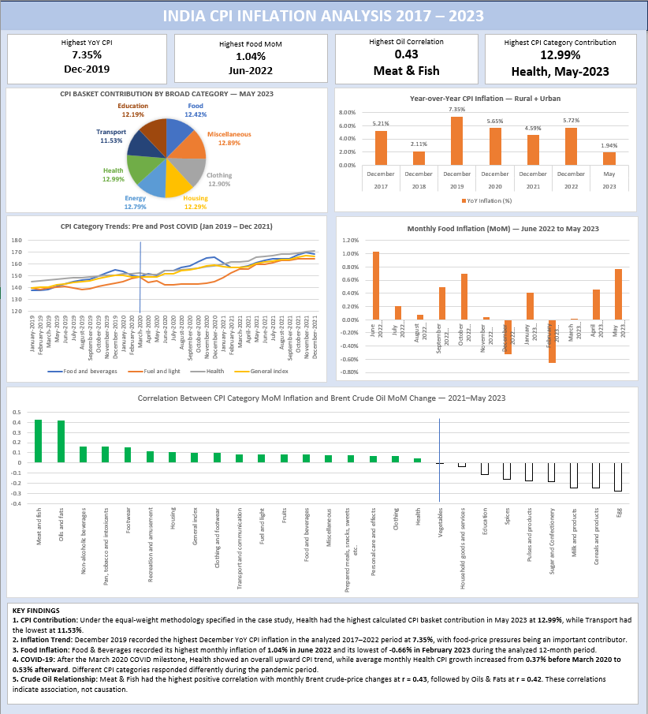

# India CPI Inflation Analysis

An Excel-based analysis of India's Consumer Price Index (CPI) to identify inflation trends, food inflation patterns, category-level movements, the COVID-19 period, and the relationship between crude oil prices and CPI categories.

## Project Overview

This project analyzes monthly Consumer Price Index data for India using Microsoft Excel.

The objective is to transform raw CPI data into meaningful insights through data cleaning, time-series analysis, percentage-change calculations, correlation analysis, and dashboard visualization.

## Business Questions

The analysis addresses five key questions:

1. How is the CPI basket distributed across broader categories?
2. How has CPI inflation changed over time?
3. How did food inflation behave during the 12 months ending May 2023?
4. How did selected CPI categories behave around the COVID-19 period?
5. What relationship can be observed between crude oil price movements and CPI categories?

## Dataset

- **Source:** Government of India CPI data
- **Coverage:** January 2013 – May 2023
- **Sectors:** Rural, Urban, Rural + Urban
- **Frequency:** Monthly
- **Measure:** Consumer Price Index
- **Format:** CSV

The raw dataset is included in the `Data` folder.

## Tools & Skills

- Microsoft Excel
- Data Cleaning
- XLOOKUP
- AVERAGE
- MAX / MIN
- Percentage Change
- CORREL
- Conditional Formatting
- Time-Series Analysis
- Data Visualization
- Dashboard Development

## Analysis Performed

### 1. CPI Basket Contribution

Broader CPI categories were created by grouping related sub-categories.

Using the equal-weight methodology specified in the case study, the broader-category index was calculated and its percentage contribution to the overall grouped basket was determined.

**May 2023 – Rural + Urban**

- Health: **12.99%**
- Clothing & Footwear: **12.90%**
- Miscellaneous: **12.89%**
- Energy: **12.79%**
- Food: **12.42%**
- Housing: **12.29%**
- Education: **12.19%**
- Transport: **11.53%**

> Note: These are case-study calculations based on the specified equal-weight methodology and should not be interpreted as official expenditure-weighted CPI contributions.

### 2. CPI Inflation Trend

Year-over-year CPI inflation was calculated using December CPI values for comparable years.

The highest December YoY inflation rate in the selected period was:

**7.35% — December 2019**

### 3. Food Inflation

Food inflation was analyzed using a broader food category created from food-related CPI sub-categories.

Key observations:

- Highest monthly food inflation: **1.04% — June 2022**
- Lowest monthly food inflation: **-0.66% — February 2023**
- May 2023 food inflation: **0.76%**

From May 2022 to May 2023:

- Largest positive category change: **Spices (+33.1 index points)**
- Largest negative category change: **Oils & Fats (-32.4 index points)**

### 4. COVID-19 Period Analysis

CPI movements were compared before and after the March 2020 COVID-19 milestone.

Selected observations included:

- Health average monthly inflation increased from **0.37%** before March 2020 to **0.53%** after March 2020.
- Fuel & Light increased from **0.45%** to **0.56%**.
- Food & Beverages decreased from **0.77%** to **0.41%**.
- General Index decreased from **0.55%** to **0.44%**.

The analysis is descriptive and identifies differences in CPI movements across the two periods rather than establishing causal effects.

### 5. Crude Oil & CPI Correlation

Monthly changes in Brent crude oil prices were compared with monthly CPI inflation changes from January 2021 to May 2023.

Highest positive correlations observed:

| CPI Category | Correlation |
|---|---:|
| Meat & Fish | **0.43** |
| Oils & Fats | **0.42** |
| Non-alcoholic Beverages | **0.16** |
| Pan, Tobacco & Intoxicants | **0.16** |

Fuel & Light and Transport & Communication showed relatively weak contemporaneous correlations in this sample.

> Note: Brent crude was used as a global crude-oil benchmark/proxy. Correlation measures linear association and does not establish causality.

## Dashboard

The project includes an Excel dashboard summarizing the major findings from Q1–Q5.



## Project Structure

```text
india-cpi-inflation-analysis/
│
├── Data/
│   └── CPI_raw_data.csv
│
├── Excel/
│   └── India_CPI_Inflation_Analysis.xlsb
│
├── Screenshots/
│   └── dashboard.png
│
└── README.md


## Key Takeaways

1. **CPI Contribution:** Under the equal-weight methodology specified in the case study, Health had the highest calculated CPI basket contribution in May 2023 at 12.99%, while Transport had the lowest at 11.53%.

2. **Inflation Trend:** December 2019 recorded the highest December YoY CPI inflation in the analyzed 2017–2022 period at 7.35%.

3. **Food Inflation:** Food & Beverages recorded its highest monthly inflation of 1.04% in June 2022 and its lowest of -0.66% in February 2023 during the analyzed 12-month period.

4. **COVID-19:** After the March 2020 COVID milestone, monthly average Health CPI growth increased from 0.37% before March 2020 to 0.53% afterward.

5. **Crude Oil Relationship:** Meat & Fish had the highest positive correlation with monthly Brent crude-price changes at r = 0.43, followed by Oils & Fats at r = 0.42. Correlation indicates association, not causation.

## Methodology Notes

- CPI category contributions were calculated using the equal-weight methodology specified in the case study.
- Month-on-month (MoM) and year-on-year (YoY) inflation were calculated using percentage changes in CPI indices.
- Q2 uses December CPI values to calculate December YoY inflation.
- Q5 uses Brent crude as a global crude-oil price benchmark and proxy for imported oil-price movements.
- Correlation measures linear association and does not establish causality.
